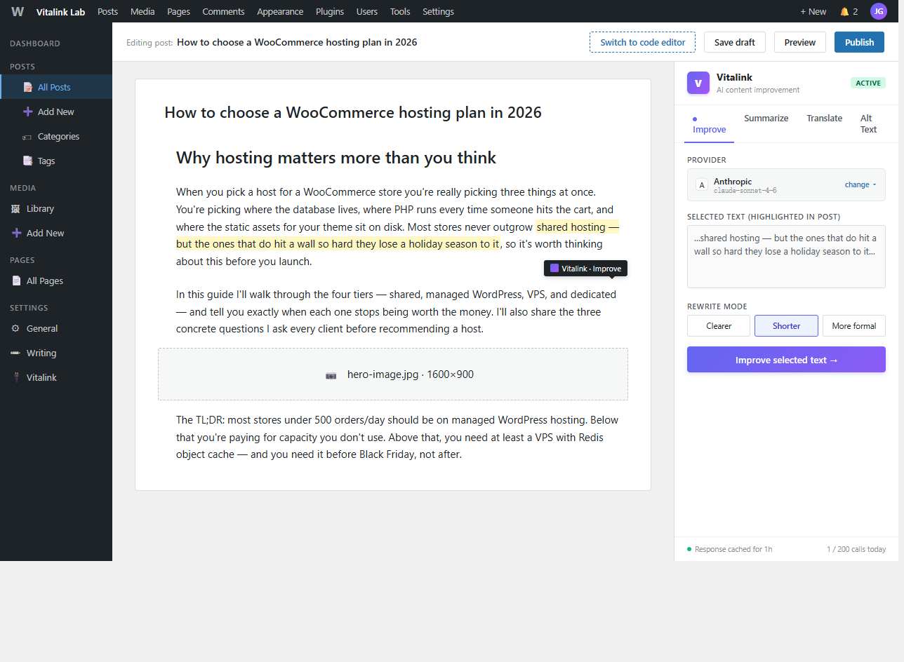

# Vitalink Content Improver

[](https://github.com/48055080/vitalink-content-improver/actions)
[](https://www.gnu.org/licenses/gpl-2.0.html)
[](https://wordpress.org/download/)
[](https://www.php.net/)
[](https://github.com/48055080/vitalink-content-improver/stargazers)
[](https://github.com/48055080/vitalink-content-improver/releases)

> Multi-provider AI content improvement for the WordPress block editor.

Vitalink adds an AI sidebar to Gutenberg with four features — **Improve**,
**Summarize**, **Translate**, and **Alt Text** — and works with three AI
providers out of the box: **OpenAI**, **Anthropic**, or a self-hosted
**Ollama** instance.



---

## Why Vitalink?

Most AI WordPress plugins support one provider. Vitalink supports three, and you
can switch any time without losing work.

- **Multi-provider** — OpenAI, Anthropic, or self-hosted Ollama. Switchable
  any time, with all your API keys encrypted at rest (libsodium or
  OpenSSL fallback).
- **Response caching** — identical repeat requests return cached results.
  Zero extra API cost when you bulk-edit or rerun a job.
- **Self-hostable** — Ollama means no API key, no data leak, no subscription.
  Run Llama 3.1, Mistral, or any other open model on your own server.
- **No markup** — pay your AI provider directly. We charge nothing.
- **WordPress-native** — Gutenberg sidebar, REST API, WP-CLI, PHPUnit
  + WP test framework. No Electron, no SaaS lock-in.
- **Production-tested patterns** — Provider interface + factory, custom
  providers register via `vitalink_ci_register_providers` filter.

## Features

| Feature | What it does |
|---|---|
| **Improve** | Rewrite selected text. Three modes: clearer, shorter, more formal. |
| **Summarize** | Condense a long post into 50, 150, or 300 words. |
| **Translate** | Translate the post or selection to any language. Defaults to the site's language. |
| **Alt Text** | Auto-generate alt text when you upload an image. |

All four features are exposed in the editor sidebar **and** as WP-CLI commands
**and** as REST endpoints — same provider, same cache, same UI.

## Quick start

```bash
# Clone
git clone https://github.com/48055080/vitalink-content-improver.git
cd vitalink-content-improver

# Install PHP deps
composer install

# Install JS deps
npm install

# Build the editor sidebar bundle
npm run build

# Symlink into a WP install
ln -s ../../path/to/wp-content/plugins/vitalink-content-improver trunk
```

Then in WordPress admin: **Plugins → Activate Vitalink Content
Improver → Settings → Vitalink** to configure your provider.

## WP-CLI

```bash
wp vitalink ci improve "Some clunky sentence." --style=clearer
wp vitalink ci summarize "Long article body..." --length=150
wp vitalink ci translate "Hello." "Simplified Chinese"
wp vitalink ci alt-text 123
```

## REST API

```
POST /wp-json/vitalink-ci/v1/improve
POST /wp-json/vitalink-ci/v1/summarize
POST /wp-json/vitalink-ci/v1/translate
POST /wp-json/vitalink-ci/v1/alt-text
```

All endpoints require `edit_posts` capability and a valid `X-WP-Nonce`.

## Documentation

- [Architecture overview](./docs/architecture.md) — how the pieces fit
- [Hooks & filters reference](./docs/hooks.md) — every filter and action
- [Authoring a custom provider](./docs/providers.md) — register your own AI backend
- [Brand guidelines](../BRAND.md) — naming, shared architecture, plugin roadmap

## Requirements

- WordPress 6.4 or later
- PHP 8.1 or later
- For the editor sidebar: a modern browser
- For self-hosted mode: an Ollama installation (https://ollama.ai)

## Testing

```bash
composer test      # PHPUnit
composer lint      # PHPCS (WordPress coding standards)
composer stan      # PHPStan (static analysis)
```

CI runs against PHP 8.1, 8.2, 8.3 × WordPress 6.4, 6.5, 6.6 (12 combinations).

## Contributing

Issues and PRs welcome. For a new provider, see
[`docs/providers.md`](./docs/providers.md).

## License

GPL v2 or later. See [LICENSE.txt](./LICENSE.txt).

---

Vitalink is a family of open-source WordPress plugins. See the
[brand guidelines](../BRAND.md) for naming conventions, shared
architecture, and the plugin roadmap.